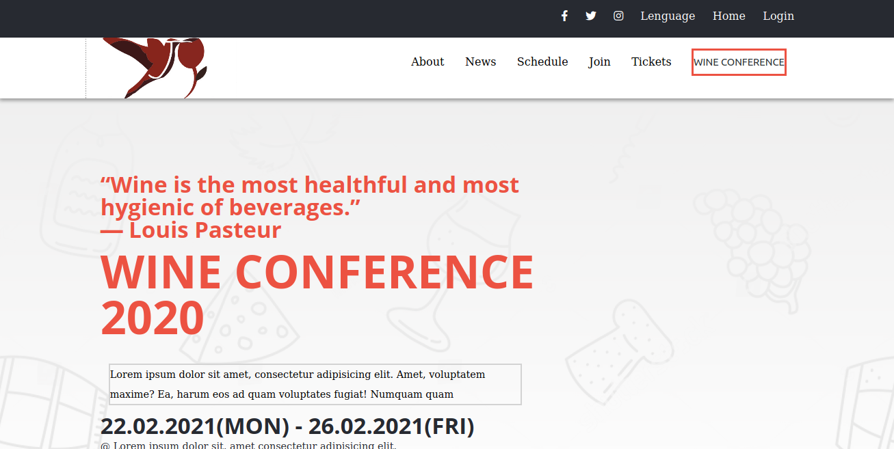

# The Newsweek Responsive

In this project, I made a Wine conference web site with three different pages.

In this project, I make a Wine Conference page, using the given design of the website <a href="https://www.behance.net/gallery/29845175/CC-Global-Summit-2015">CC Global Summit 2015</a> by <a href="https://www.behance.net/adagio07">Cindy Shin</a>. I build three pages 1. Main page (index) 2. About page and 3. Tickets page. Each page with 2 different screen sizes up to 768px for mobile and from 768px for desktop version. Including the colors, typographies, and layouts for both sizes according to Cindy's website. You can clone the repository with this link <a href="https://github.com/gasb150/conference-page.git">repository<a>

## Live Demo

[Visit Page] (https://raw.githack.com/gasb150/conference-page/feature/index.html)

## Video Description

[Video] (https://www.loom.com/share/69e17f7e05de46618bff9ec5cd23571a)

## Built With

- HTML5
- CSS3

## Authors

:bird: **Gustavo Sanmartin**

- GitHub: [@gasb150](https://github.com/gasb150)
- Twitter: [@7aves](https://twitter.com/7aves)
- LinkedIn: [Gutavo Sanmartin](https://www.linkedin.com/in/gustavo-sanmartin-b3b68261/)

## Acknowledgments

- [Microverse](https://www.microverse.org/)
- [The Odin Project](https://www.theodinproject.com)
- [w3schools](https://www.w3schools.com)

## Show your support

 Give a 
  <g-emoji class="g-emoji" alias="star" fallback-src="https://github.githubassets.com/images/icons/emoji/unicode/2b50.png"></g-emoji>
  if you like this project!

## License
  
This project is <a href="../feature/LICENSE">MIT</a> licensed.
